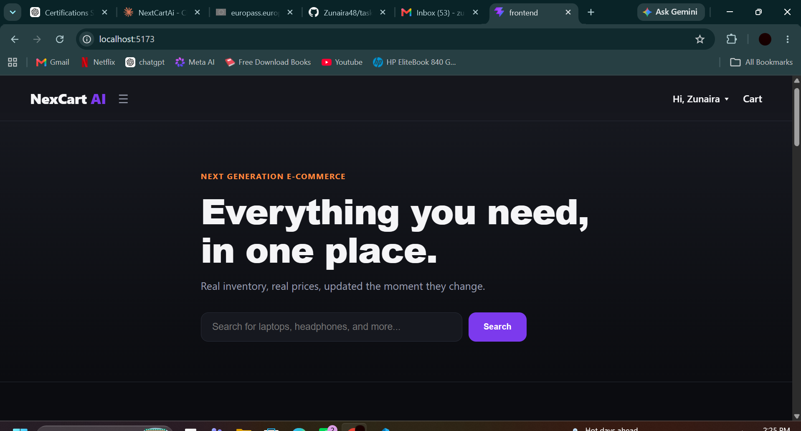
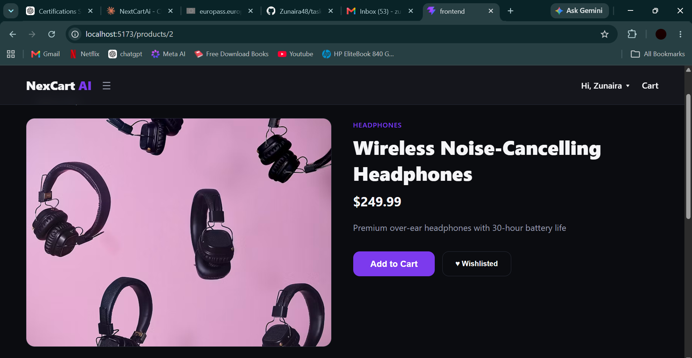
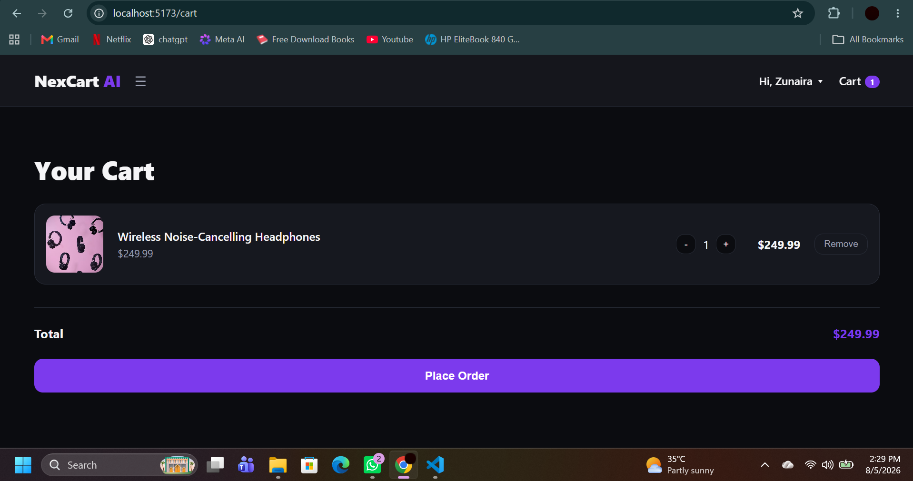
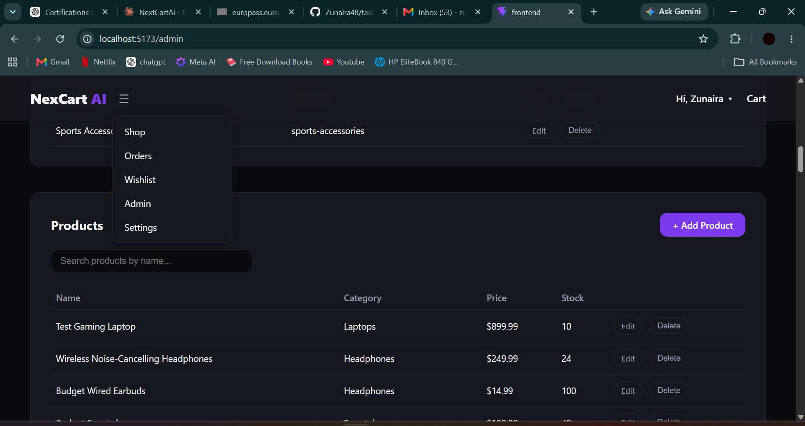

# NexCart AI 🛒

**Next Generation E-Commerce** — a full-stack e-commerce platform built from scratch, feature by feature, as a hands-on learning project and portfolio piece.


**🔗 Live Demo:** [nexcart-ai.vercel.app](https://nexcart-ai.vercel.app)

---

## Overview

NexCart AI is a production-inspired e-commerce platform covering the full customer journey — browsing, search, cart, checkout, order history, wishlist, and reviews — plus a real admin dashboard for managing the store. It was built incrementally, one working feature at a time, with real bugs hit and fixed along the way rather than generated in a single pass.

An AI features phase (natural language search, product recommendations, review summarization, and more) is planned as the next major milestone, once the core commerce platform is fully stable.

## Features

**Customer-facing**
- JWT-based authentication (register, login, persistent session)
- Forgot password / reset password via emailed reset link
- Email verification on signup
- Product catalog with search, category filtering, and "Load More" pagination
- Product detail pages with reviews and star ratings
- Shopping cart with live item-count badge
- Checkout flow with stock validation and order history
- Wishlist
- Dark / light theme toggle

**Admin**
- Role-based access control (customer / admin)
- Category and product management (create, edit, delete) via dedicated UI — no need to touch Swagger docs
- Order management with status updates (pending → processing → shipped → delivered → cancelled)

**Engineering**
- Full CRUD REST API with FastAPI + SQLAlchemy
- Idempotent database seed scripts (curated + bulk product data)
- Alembic migrations for schema versioning
- Responsive, theme-aware UI built entirely on CSS custom properties

## Tech Stack

| Layer | Technology |
|---|---|
| Frontend | React, Vite, React Router v7, Axios |
| Backend | FastAPI, SQLAlchemy, Pydantic v2 |
| Auth | JWT (python-jose), bcrypt password hashing |
| Database | Microsoft SQL Server (local dev) / PostgreSQL via Supabase (production) |
| Migrations | Alembic |
| Transactional Email | Resend (password reset, email verification) |
| Deployment | Vercel (frontend) · Render (backend) · Supabase (database) |

## Screenshots

| Home | Product Detail |
|---|---|
|  |  |

| Cart | Admin Dashboard |
|---|---|
|  |  |

## Getting Started

### Prerequisites
- Python 3.13+
- Node.js 18+
- Microsoft SQL Server (local) or a PostgreSQL connection string

### Backend Setup

```bash
cd backend
python -m venv venv
venv\Scripts\activate          # Windows
pip install -r requirements.txt
```

Create `backend/.env` (see `.env.example` for the required variables), then:

```bash
uvicorn app.main:app --reload
```

Backend runs at `http://localhost:8000` — interactive API docs at `http://localhost:8000/docs`.

**Optional — seed sample data:**
```bash
python -m app.db.seed          # curated products
python -m app.db.seed_bulk     # ~150 additional products from a public API
```

### Frontend Setup

```bash
cd frontend
npm install
```

Create `frontend/.env` (see `.env.example`), then:

```bash
npm run dev
```

Frontend runs at `http://localhost:5173`.

### Environment Variables

**Backend (`backend/.env`)**

| Variable | Description |
|---|---|
| `DATABASE_URL` | MSSQL (local) or PostgreSQL (production) connection string |
| `SECRET_KEY` | JWT signing secret |
| `ALGORITHM` | JWT algorithm (`HS256`) |
| `ACCESS_TOKEN_EXPIRE_MINUTES` | Access token lifetime |
| `RESEND_API_KEY` | API key from [resend.com](https://resend.com), used for password-reset and verification emails |
| `EMAIL_FROM` | Sender address (e.g. `onboarding@resend.dev` in Resend sandbox mode) |
| `FRONTEND_URL` | Base URL the emailed reset/verify links point to (e.g. `http://localhost:5173` locally, live domain in production) |

**Frontend (`frontend/.env`)**

| Variable | Description |
|---|---|
| `VITE_API_URL` | Base URL of the backend API |

> ⚠️ Resend's sandbox mode (no custom domain verified) only delivers to the email address the Resend account itself was created with. Verify a domain in Resend to send to arbitrary recipients.

## Project Structure

```
nexcart-ai/
├── backend/
│   └── app/
│       ├── core/       # config, security (JWT, hashing, role checks)
│       ├── db/         # database session, seed scripts
│       ├── models/     # SQLAlchemy models
│       ├── schemas/    # Pydantic request/response schemas
│       └── api/        # route handlers, grouped by resource
├── frontend/
│   └── src/
│       ├── components/ # reusable UI (Navbar, ProductCard, etc.)
│       ├── context/    # React Context providers (Auth, Cart, Wishlist, Theme)
│       ├── pages/       # route-level pages, including admin/
│       └── services/   # API client functions
└── docs/               # additional documentation and screenshots
```

## Roadmap

- [x] Deployment (frontend + backend + database, entirely on free tiers)
- [x] Forgot password / email verification flow
- [ ] AI Shopping Assistant
- [ ] Natural language product search
- [ ] AI-powered recommendations
- [ ] Review summarization
- [ ] Additional AI features (see project notes)

## License

This project is licensed under the MIT License — see [LICENSE](./LICENSE) for details.
